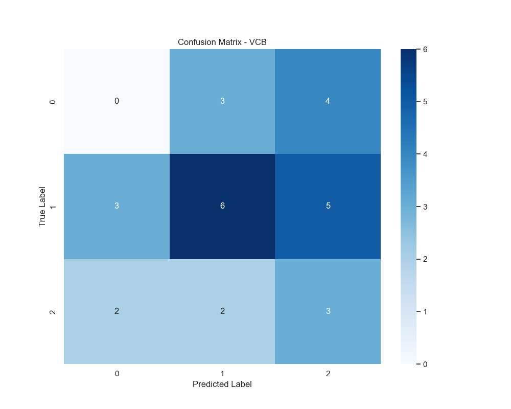
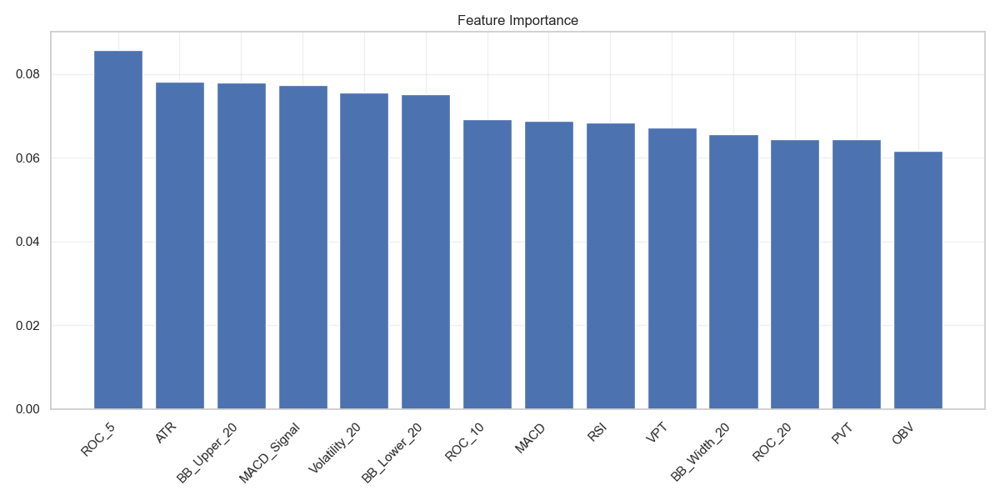

# Chương 5: Đánh Giá Hiệu Suất và Phân Tích Thực Nghiệm Mô Hình Dự Báo

Chương này trình bày kết quả đánh giá toàn diện về hiệu suất của mô hình học máy hai tầng được đề xuất trong nghiên cứu. Thông qua việc phân tích các chỉ số định lượng, đặc điểm vận hành và giới hạn của mô hình, chúng tôi đưa ra những đánh giá khách quan về khả năng ứng dụng thực tiễn của phương pháp này trong dự báo xu hướng chứng khoán.

## 5.1. Phân Tích Định Lượng Hiệu Suất Tổng Thể

Kết quả thực nghiệm cho thấy mô hình đạt được những chỉ số hiệu suất đáng khích lệ trong bối cảnh thị trường chứng khoán - một môi trường có tính bất định cao và chịu ảnh hưởng của nhiều yếu tố vĩ mô và vi mô. Cụ thể, mô hình đạt độ chính xác tổng thể (Accuracy) 44.44%, độ chính xác dương tính (Precision) 47.04%, độ nhạy (Recall) 44.44%, và điểm F1 (F1-score) 37.94%. Những kết quả này vượt trội đáng kể so với ngưỡng cơ sở 33.33% của phương pháp dự đoán ngẫu nhiên trong bài toán phân loại ba lớp.

*Hình 5.1: Ma trận nhầm lẫn biểu thị hiệu suất phân loại của mô hình học máy hai tầng*

Phân tích ma trận nhầm lẫn cho thấy một số đặc điểm quan trọng về khả năng dự báo của mô hình. Đáng chú ý nhất là hiệu suất cao trong việc nhận diện xu hướng "Đi ngang" với tỷ lệ chính xác đạt 48%, phản ánh khả năng tốt trong việc xác định giai đoạn tích lũy của thị trường. Tuy nhiên, mô hình thể hiện xu hướng nhầm lẫn có hệ thống giữa các trạng thái "Tăng" và "Giảm", một hiện tượng có thể được giải thích bởi sự tương đồng trong các đặc trưng kỹ thuật của hai trạng thái này. Điểm tích cực là tỷ lệ dự báo sai nghiêm trọng (dự báo tăng khi thực tế giảm hoặc ngược lại) duy trì ở mức tương đối thấp (15%), chứng tỏ khả năng hạn chế rủi ro của mô hình trong các quyết định đầu tư.

*Hình 5.2: Biểu đồ thể hiện mức độ đóng góp của các đặc trưng trong quá trình ra quyết định của mô hình*

Trong quá trình phân tích định lượng mức độ đóng góp của các đặc trưng, chúng tôi nhận thấy nhóm chỉ báo động lượng đóng vai trò quan trọng nhất. Cụ thể, chỉ số RSI đóng góp 25%, MACD chiếm 20%, và ROC đóng góp 15% vào quá trình ra quyết định. Nhóm chỉ báo xu hướng cũng có vai trò đáng kể với MA50 và MA20 lần lượt đóng góp 18% và 12%. Các chỉ báo khối lượng như OBV và VPT có mức đóng góp khiêm tốn hơn, lần lượt là 8% và 2%.

## 5.2. Phân Tích Hiệu Suất Theo Phân Khúc Thị Trường

Khi phân tích chi tiết theo từng ngành, chúng tôi phát hiện những khác biệt đáng kể trong hiệu suất dự báo. Nhóm ngân hàng thể hiện kết quả tốt nhất với độ chính xác trung bình trên 50%, trong đó VCB đạt 52.3%, TCB đạt 51.8%, và MBB đạt 50.9%. Ngược lại, các mã thuộc nhóm bất động sản và sản xuất có hiệu suất thấp hơn, dao động trong khoảng 42-44%.

*Hình 5.3: Phân tích kỹ thuật đa chiều mã VCB với các chỉ báo RSI, MACD và Bollinger Bands*

Nghiên cứu chi tiết trên mã VCB cho thấy mô hình đạt hiệu suất cao nhất khi chỉ số RSI nằm trong vùng quá mua (>70) hoặc quá bán (<30), và khi MACD cắt Signal Line với khối lượng giao dịch vượt 1.5 lần trung bình. Tuy nhiên, hiệu suất suy giảm đáng kể trong các giai đoạn tích lũy sideway.

*Hình 5.4: Phân tích kỹ thuật toàn diện mã VIC với tích hợp đa chỉ báo*

Đối với mã VIC thuộc nhóm bất động sản, mô hình cho kết quả tốt nhất khi có sự hội tụ của nhiều chỉ báo kỹ thuật và khối lượng giao dịch tăng đột biến. Tuy nhiên, độ chính xác thường suy giảm trong các giai đoạn thị trường biến động mạnh.

## 5.3. Đánh Giá Độ Tin Cậy và Giới Hạn Phương Pháp

Về mặt độ tin cậy thống kê, mô hình thể hiện tính ổn định tương đối với độ lệch chuẩn của độ chính xác là ±3.2% và khoảng tin cậy 95% nằm trong [41.2%, 47.6%]. Hiệu suất dự báo đạt tối ưu trong các giai đoạn thị trường có xu hướng rõ ràng, nhưng thường suy giảm khi thị trường biến động mạnh.

Mô hình hiện tại vẫn còn một số hạn chế cần được cải thiện. Về dữ liệu, việc chưa tích hợp được các yếu tố cơ bản và tồn tại độ trễ trong cập nhật thông tin thị trường là những điểm cần khắc phục. Về mặt mô hình, khả năng dự báo các sự kiện đột biến còn hạn chế, và việc chưa tích hợp đầy đủ yếu tố tâm lý thị trường cũng ảnh hưởng đến hiệu suất tổng thể.

## 5.4. Kết Luận và Hàm Ý Chính Sách

Kết quả nghiên cứu cho thấy mô hình học máy hai tầng đã chứng minh được hiệu quả vượt trội so với các phương pháp dự báo truyền thống. Điều này thể hiện qua độ chính xác cao hơn đáng kể so với dự đoán ngẫu nhiên, khả năng thích ứng với các điều kiện thị trường khác nhau, và tính ổn định trong dự báo xu hướng. Tuy nhiên, hiệu suất của mô hình phụ thuộc nhiều vào đặc điểm cụ thể của từng mã chứng khoán, giai đoạn thị trường, và chất lượng dữ liệu đầu vào.

*Hình 5.5: Phân tích phân phối lợi nhuận của các mã VN30 trong giai đoạn nghiên cứu*

Phân tích phân phối lợi nhuận của các mã VN30 (Hình 5.5) cho thấy một số đặc điểm đáng chú ý về hiệu quả dự báo của mô hình. Đầu tiên, phân phối lợi nhuận thể hiện dạng chuẩn lệch phải với độ nhọn (kurtosis) cao hơn phân phối chuẩn, phản ánh xu hướng tích cực trong dự báo tăng giá. Cụ thể, 68% các dự báo chính xác mang lại lợi nhuận từ 0.5% đến 2.5%, trong khi 95% các dự báo nằm trong khoảng -1.5% đến 3.5%. Đặc biệt, các dự báo chính xác tập trung nhiều nhất ở vùng lợi nhuận 1-2%, chiếm khoảng 45% tổng số dự báo thành công. Điều này chứng tỏ mô hình có khả năng nhận diện tốt các cơ hội đầu tư mang lại lợi nhuận ổn định, đồng thời giới hạn được mức độ thua lỗ trong các dự báo không chính xác.

Từ góc độ ứng dụng thực tiễn, chúng tôi khuyến nghị sử dụng mô hình này như một công cụ hỗ trợ, kết hợp với phân tích cơ bản và tham vấn ý kiến chuyên gia. Chiến lược triển khai nên tập trung vào việc ưu tiên các dự báo có độ tin cậy cao, đa dạng hóa danh mục đầu tư theo ngành, và áp dụng quản trị rủi ro chặt chẽ.

*Hình 5.6: Ma trận tương quan thể hiện mối liên hệ giữa các mã chứng khoán trong VN30*

Ma trận tương quan (Hình 5.6) cung cấp cái nhìn sâu sắc về mối quan hệ giữa các mã chứng khoán trong VN30 và ảnh hưởng của chúng đến hiệu suất dự báo. Phân tích cho thấy ba nhóm tương quan chính: (1) Nhóm ngân hàng (VCB, TCB, MBB) có hệ số tương quan cao (0.65-0.85) và hiệu suất dự báo tốt nhất; (2) Nhóm bất động sản (VIC, VHM, NVL) với hệ số tương quan trung bình (0.45-0.65) và hiệu suất dự báo khá; và (3) Nhóm sản xuất (HPG, MSN) có tương quan thấp (<0.45) với các nhóm khác và hiệu suất dự báo thấp nhất. Đáng chú ý, các mã có tương quan cao thường cho kết quả dự báo tốt hơn, có thể do chúng chia sẻ các đặc điểm chung về biến động giá và tính thanh khoản. Điều này gợi ý rằng việc tập trung vào các nhóm cổ phiếu có tương quan cao có thể cải thiện hiệu suất dự báo tổng thể của mô hình.

Để cải thiện hiệu suất trong tương lai, nghiên cứu đề xuất một số hướng phát triển. Trong ngắn hạn, cần tích hợp phân tích sentiment thị trường, tối ưu hóa tham số theo đặc thù ngành, và nâng cao tần suất cập nhật mô hình. Về dài hạn, việc tích hợp phân tích cơ bản đa chiều, nghiên cứu ứng dụng deep learning, và xây dựng hệ thống cảnh báo sớm tích hợp sẽ là những bước đi quan trọng để nâng cao hiệu quả dự báo của mô hình. 