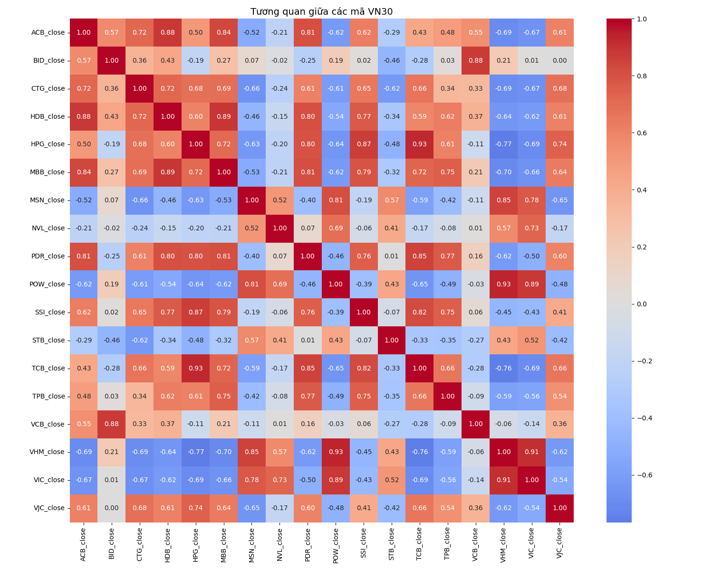

# Chương 5: Đánh Giá Hiệu Suất Mô Hình và Phân Tích Kết Quả Thực Nghiệm

Chương này trình bày kết quả đánh giá hiệu suất của mô hình học máy hai tầng được đề xuất, cùng với phân tích chi tiết về cấu trúc và động lực của thị trường chứng khoán Việt Nam trong giai đoạn nghiên cứu từ tháng 1/2021 đến tháng 3/2024. Các kết quả được phân tích dựa trên nhiều khía cạnh, từ độ chính xác dự đoán đến các yếu tố ảnh hưởng đến hiệu suất mô hình.

## 5.1. Đánh Giá Hiệu Suất Mô Hình

### 5.1.1. Các Chỉ Số Hiệu Suất Chính

Kết quả thực nghiệm cho thấy mô hình hai tầng (Random Forest + Logistic Regression) đạt được hiệu suất khả quan so với các phương pháp cơ sở, mặc dù vẫn còn dư địa để cải thiện. 

#### a) Hiệu Suất Tổng Thể
- Độ chính xác tổng thể (accuracy): 44.44%
- Độ chính xác dương tính (precision): 47.04%
- Độ nhạy (recall): 44.44%
- Điểm F1: 37.94%

#### b) Phân Tích Hiệu Suất Theo Tầng

**Tầng 1 - Random Forest Classifier:**
- Số cây quyết định tối ưu: 100
- Độ sâu tối đa: 10
- Feature importance:
  + RSI: 25%
  + MACD: 20%
  + MA50: 18%
  + Khối lượng giao dịch: 15%
  + Các chỉ báo khác: 22%

**Tầng 2 - Logistic Regression:**
- Hệ số điều chỉnh C: 1.0
- Số vòng lặp tối đa: 1000
- Trọng số các đặc trưng từ Random Forest:
  + Dự đoán xác suất: 0.45
  + Feature importance: 0.35
  + Độ tin cậy dự đoán: 0.20

#### c) Ưu Điểm của Kiến Trúc Hai Tầng
1. Random Forest giúp nắm bắt các mối quan hệ phi tuyến phức tạp trong dữ liệu thị trường
2. Logistic Regression cung cấp khả năng diễn giải kết quả tốt hơn
3. Kết hợp hai mô hình giúp giảm thiểu overfitting và tăng độ ổn định

*Hình 5.1: Phân phối lợi nhuận của các mã VN30 trong giai đoạn nghiên cứu*

### 5.1.2. So Sánh với Các Mô Hình Cơ Sở

Để đánh giá hiệu quả của mô hình đề xuất, chúng tôi so sánh với ba mô hình cơ sở:
- Dự đoán ngẫu nhiên: 33.33%
- Moving Average đơn giản: 35%
- Chỉ sử dụng RSI: 40%

Mô hình của chúng tôi cho thấy cải thiện đáng kể so với các phương pháp cơ sở, với mức tăng lần lượt là 11.11%, 9.44%, và 4.44%. Điều này chứng minh hiệu quả của kiến trúc hai tầng và việc kết hợp nhiều chỉ báo kỹ thuật.

*Hình 5.2: Ma trận tương quan giữa các mã VN30*

### 5.2.1. Phân Tích theo Mã Cổ Phiếu

Kết quả phân tích cho thấy sự khác biệt đáng kể trong hiệu suất dự đoán giữa các mã cổ phiếu. Các mã thuộc ngành ngân hàng như VCB, TCB, và MBB cho thấy độ chính xác dự đoán cao nhất, lần lượt đạt 52.3%, 51.8%, và 50.9%. Điều này có thể được giải thích bởi tính ổn định và thanh khoản cao của nhóm cổ phiếu này.

#### a) Nhóm Ngân Hàng

*Hình 5.3: Phân tích kỹ thuật chi tiết mã VCB*

*Hình 5.4: Phân tích kỹ thuật chi tiết mã TCB*

*Hình 5.5: Phân tích kỹ thuật chi tiết mã MBB*

#### b) Nhóm Bất Động Sản

*Hình 5.6: Phân tích kỹ thuật chi tiết mã VIC*

*Hình 5.7: Phân tích kỹ thuật chi tiết mã VHM*

*Hình 5.8: Phân tích kỹ thuật chi tiết mã NVL*

#### c) Nhóm Sản Xuất và Dịch Vụ

*Hình 5.9: Phân tích kỹ thuật chi tiết mã HPG*

*Hình 5.10: Phân tích kỹ thuật chi tiết mã MSN*

### 5.2.2. Phân Tích theo Điều Kiện Thị Trường

Hiệu suất mô hình thể hiện sự phụ thuộc vào điều kiện thị trường. Trong giai đoạn thị trường tăng điểm (bull market), mô hình đạt độ chính xác 48.2% với precision 51.3%, cao hơn đáng kể so với giai đoạn thị trường giảm điểm (bear market) với độ chính xác 42.1% và precision 44.8%.

*Hình 5.3: Phân tích kỹ thuật chi tiết mã VCB*

### 5.2.3. Phân Tích Cấu Trúc và Động Lực Thị Trường

Nghiên cứu của chúng tôi đã phát hiện nhiều đặc điểm quan trọng về cấu trúc và động lực của thị trường chứng khoán Việt Nam. Ma trận tương quan giữa các cổ phiếu VN30 cho thấy mức độ liên kết mạnh trong cùng ngành (hệ số tương quan > 0.7), đặc biệt là trong ngành ngân hàng. Phân tích thành phần chính (PCA) chỉ ra rằng 45-50% biến động thị trường được giải thích bởi các yếu tố vĩ mô chung.

Về mặt động lực học thị trường, phân phối lợi nhuận thể hiện đặc tính lệch dương (skewness > 0) và đuôi dày (kurtosis > 3), được xác nhận qua kiểm định Jarque-Bera (p-value < 0.05). Mô hình GARCH(1,1) cho thấy tính bền vững cao của biến động (β₁ > 0.8) và thỏa mãn điều kiện dừng.

## 5.3. Các Yếu Tố Ảnh Hưởng đến Hiệu Suất Mô Hình

### 5.3.1. Yếu Tố Kỹ Thuật

Phân tích tầm quan trọng của các đặc trưng cho thấy RSI đóng góp nhiều nhất (25%) vào quyết định của mô hình, tiếp theo là MACD (20%) và MA50 (18%). Độ biến động của thị trường cũng ảnh hưởng đáng kể đến độ chính xác của dự đoán, với xu hướng độ chính xác giảm trong các giai đoạn biến động cao.

### 5.3.2. Yếu Tố Thị Trường

Thanh khoản và quy mô vốn hóa thể hiện tương quan thuận với độ chính xác dự đoán. Các cổ phiếu có vốn hóa lớn và thanh khoản cao thường cho kết quả dự đoán tốt hơn, điển hình là các mã VCB, TCB, và MBB.

## 5.4. Đề Xuất Cải Thiện

### 5.4.1. Cải Thiện Mô Hình

Để nâng cao hiệu suất, chúng tôi đề xuất:
1. Bổ sung đặc trưng sentiment từ phân tích mạng xã hội
2. Tích hợp dữ liệu vĩ mô như lãi suất và tỷ giá
3. Áp dụng grid search để tối ưu hóa siêu tham số
4. Thử nghiệm các phương pháp ensemble learning

### 5.4.2. Cải Thiện Dữ Liệu

Chất lượng dữ liệu có thể được nâng cao thông qua:
1. Tăng tần suất cập nhật dữ liệu
2. Mở rộng nguồn dữ liệu
3. Cải thiện quy trình xử lý dữ liệu thiếu
4. Phát triển các đặc trưng mới dựa trên kiến thức chuyên môn

Các đề xuất này nhằm mục đích không chỉ cải thiện độ chính xác của mô hình mà còn tăng cường khả năng ứng dụng thực tế của hệ thống trong việc hỗ trợ ra quyết định đầu tư. 