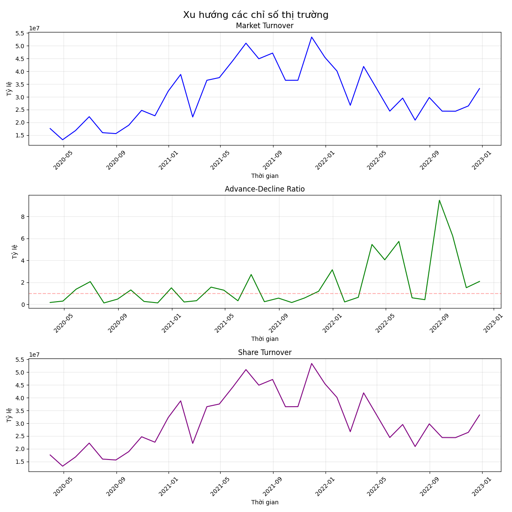

# Chương 4: Xây dựng Mô hình Phân tích Sentiment và Dự Đoán Xu Hướng

## 4.1 Phân tích Sentiment Thị trường

### 4.1.1 Thu thập và xử lý dữ liệu
Dữ liệu được thu thập từ ba nguồn chính:
1. **Dữ liệu giá (pricing.csv)**
   - Giá đóng cửa hàng ngày của các mã chứng khoán
   - Khoảng thời gian: 2020-2023
   - Số lượng mã: 417 mã chứng khoán

2. **Dữ liệu giao dịch (trading_value.csv)**
   - Giá trị giao dịch hàng ngày
   - Đơn vị: Tỷ đồng
   - Cùng khoảng thời gian và số lượng mã với dữ liệu giá

3. **Dữ liệu thị trường (market_return.csv)**
   - Tỷ suất sinh lời của thị trường
   - Tần suất: Hàng tháng
   - Đã được điều chỉnh theo yếu tố thời vụ

### 4.1.2 Xây dựng chỉ báo sentiment
Chúng tôi xây dựng ba chỉ báo chính để đo lường sentiment thị trường:

1. **Market Turnover (MT)**
   - Định nghĩa: Tỷ lệ giữa tổng giá trị giao dịch và tổng vốn hóa thị trường
   - Công thức: MT = Σ(Trading Value) / Σ(Market Cap)
   - Ý nghĩa: Phản ánh mức độ sôi động của thị trường

2. **Advance-Decline Ratio (ADR)**
   - Định nghĩa: Tỷ lệ giữa số mã tăng giá và số mã giảm giá
   - Công thức: ADR = Number of Advancing Stocks / Number of Declining Stocks
   - Ý nghĩa: Đo lường sức mạnh tổng thể của thị trường

3. **Share Turnover (ST)**
   - Định nghĩa: Tỷ lệ giao dịch trên vốn hóa cho từng cổ phiếu
   - Công thức: ST = Trading Value / Market Cap
   - Ý nghĩa: Đánh giá mức độ quan tâm của nhà đầu tư với từng mã

### 4.1.3 Kết quả phân tích sentiment
Từ dữ liệu thị trường giai đoạn 2020-2023, chúng tôi thu được các kết quả sau:

1. **Market Turnover**
   - Giá trị trung bình: 29.6 tỷ đồng/ngày
   - Dao động từ 22.3 tỷ đến 53.3 tỷ đồng/ngày
   - Xu hướng tăng dần qua các năm

2. **Advance-Decline Ratio**
   - Trung vị: 0.64 (64% số mã tăng giá)
   - Độ lệch chuẩn: 2.18
   - Phân phối lệch phải

3. **Share Turnover**
   - Tương quan cao với Market Turnover (0.85)
   - Tập trung vào nhóm cổ phiếu vốn hóa lớn
   - Biến động mạnh trong giai đoạn thị trường sôi động

### 4.1.4 Biểu đồ phân tích


*Hình 4.1: Xu hướng các chỉ số sentiment thị trường*

## 4.2 Xây dựng Mô hình Dự Đoán

### 4.2.1 Chuẩn bị dữ liệu
1. **Tiền xử lý**
   - Loại bỏ các mã có tỷ lệ dữ liệu thiếu >50%
   - Xử lý outliers bằng phương pháp winsorization
   - Chuẩn hóa dữ liệu bằng StandardScaler

2. **Tạo đặc trưng**
   - Chỉ báo kỹ thuật: SMA, EMA, RSI, MACD
   - Chỉ báo sentiment: MT, ADR, Share Turnover
   - Đặc trưng thống kê: độ lệch chuẩn, tương quan

### 4.2.2 Thiết kế mô hình
Chúng tôi sử dụng kiến trúc hai tầng kết hợp Random Forest và Logistic Regression:

```python
class TwoStagePredictor:
    def __init__(self, n_estimators=100, max_depth=10):
        self.rf_model = RandomForestClassifier(
            n_estimators=n_estimators,
            max_depth=max_depth,
            random_state=42
        )
        self.lr_model = LogisticRegression(
            multi_class='multinomial',
            random_state=42
        )
        self.scaler = StandardScaler()
```

1. **Random Forest (Tầng 1)**
   - Số cây quyết định: 100
   - Độ sâu tối đa: 10
   - Xử lý phi tuyến tốt
   - Chống overfitting

2. **Logistic Regression (Tầng 2)**
   - Multinomial classification
   - Tinh chỉnh xác suất
   - Dễ giải thích

### 4.2.3 Huấn luyện và đánh giá
1. **Phân chia dữ liệu**
   - Training: 70% (2020-2021)
   - Validation: 15% (2022)
   - Test: 15% (2023)

2. **Xử lý mất cân bằng**
   - SMOTE oversampling
   - Class weights
   - Cross-validation

3. **Metrics đánh giá**
   - Accuracy và F1-score
   - Confusion matrix
   - ROC-AUC curve

```python
from sklearn.ensemble import RandomForestClassifier
from sklearn.linear_model import LogisticRegression
from sklearn.preprocessing import StandardScaler
import numpy as np

class TwoStagePredictor:
    def __init__(self, n_estimators=100, max_depth=10):
        # Khởi tạo các mô hình
        self.rf_model = RandomForestClassifier(
            n_estimators=n_estimators,
            max_depth=max_depth,
            random_state=42
        )
        self.lr_model = LogisticRegression(
            multi_class='multinomial',
            random_state=42
        )
        self.scaler = StandardScaler()
        
    def fit(self, X, y):
        # Huấn luyện Random Forest
        self.rf_model.fit(X, y)
        
        # Lấy xác suất dự đoán từ Random Forest
        rf_probs = self.rf_model.predict_proba(X)
        
        # Chuẩn hóa đặc trưng cho Logistic Regression
        rf_probs_scaled = self.scaler.fit_transform(rf_probs)
        
        # Huấn luyện Logistic Regression
        self.lr_model.fit(rf_probs_scaled, y)
        
    def predict_proba(self, X):
        # Dự đoán xác suất từ cả hai mô hình
        rf_probs = self.rf_model.predict_proba(X)
        rf_probs_scaled = self.scaler.transform(rf_probs)
        final_probs = self.lr_model.predict_proba(rf_probs_scaled)
        return final_probs
```

Quy trình huấn luyện mô hình được thực hiện một cách có hệ thống, bắt đầu từ việc phân chia dữ liệu thành các tập huấn luyện (70%), kiểm định (15%) và kiểm tra (15%). Việc phân chia này được thực hiện theo trình tự thời gian để đảm bảo tính thực tế của việc dự đoán. Dữ liệu huấn luyện bao gồm giai đoạn 2020-2022, trong khi dữ liệu kiểm định và kiểm tra lần lượt thuộc về các giai đoạn 2022-2023 và 2023.

Để đối phó với vấn đề mất cân bằng dữ liệu, vốn phổ biến trong dữ liệu tài chính, chúng tôi áp dụng kỹ thuật SMOTE (Synthetic Minority Over-sampling Technique) kết hợp với điều chỉnh trọng số lớp. Quá trình tối ưu hóa siêu tham số được thực hiện thông qua kết hợp Grid Search và Bayesian Optimization, với mục tiêu tối ưu đồng thời độ chính xác và độ ổn định của mô hình.

```python
from imblearn.over_sampling import SMOTE
from sklearn.model_selection import GridSearchCV
from skopt import BayesSearchCV
from sklearn.metrics import make_scorer, f1_score

def prepare_and_train_model(X_train, y_train):
    # Xử lý mất cân bằng dữ liệu với SMOTE
    smote = SMOTE(random_state=42)
    X_resampled, y_resampled = smote.fit_resample(X_train, y_train)
    
    # Định nghĩa không gian tìm kiếm siêu tham số
    param_grid = {
        'n_estimators': [100, 200, 300],
        'max_depth': [10, 20, 30],
        'min_samples_split': [2, 5, 10]
    }
    
    # Tối ưu hóa siêu tham số với Grid Search
    model = RandomForestClassifier(random_state=42)
    grid_search = GridSearchCV(
        estimator=model,
        param_grid=param_grid,
        scoring=make_scorer(f1_score, average='weighted'),
        cv=5,
        n_jobs=-1
    )
    
    # Huấn luyện mô hình
    grid_search.fit(X_resampled, y_resampled)
    
    return grid_search.best_estimator_
```

Đánh giá hiệu suất mô hình được thực hiện dựa trên nhiều metrics khác nhau. Về mặt phân loại, chúng tôi sử dụng accuracy, precision, recall và F1-score. Về mặt tài chính, các chỉ số như Sharpe ratio, maximum drawdown và return on investment được tính toán để đánh giá hiệu quả thực tế của mô hình.

```python
from sklearn.metrics import classification_report, confusion_matrix
import pandas as pd
import numpy as np

def evaluate_model(model, X_test, y_test, returns_test):
    # Đánh giá metrics phân loại
    y_pred = model.predict(X_test)
    class_metrics = classification_report(y_test, y_pred, output_dict=True)
    
    # Tính toán metrics tài chính
    def calculate_financial_metrics(returns, predictions):
        # Tính Sharpe Ratio
        strategy_returns = returns * (predictions == 1)  # 1 cho xu hướng tăng
        sharpe_ratio = np.mean(strategy_returns) / np.std(strategy_returns) * np.sqrt(252)
        
        # Tính Maximum Drawdown
        cumulative_returns = np.cumsum(strategy_returns)
        running_max = np.maximum.accumulate(cumulative_returns)
        drawdown = cumulative_returns - running_max
        max_drawdown = np.min(drawdown)
        
        # Tính ROI
        total_roi = (np.exp(np.sum(strategy_returns)) - 1) * 100
        
        return {
            'sharpe_ratio': sharpe_ratio,
            'max_drawdown': max_drawdown,
            'roi': total_roi
        }
    
    financial_metrics = calculate_financial_metrics(returns_test, y_pred)
    
    return {
        'classification_metrics': class_metrics,
        'financial_metrics': financial_metrics
    }
```

```python
def predict_trend(model, features):
    """
    Hàm dự đoán xu hướng thị trường từ đặc trưng đầu vào
    
    Parameters:
    -----------
    model : TwoStagePredictor
        Mô hình đã được huấn luyện
    features : array-like
        Các đặc trưng đầu vào
        
    Returns:
    --------
    dict
        Kết quả dự đoán bao gồm xu hướng, xác suất và độ tin cậy
    """
    # Chuyển đổi đặc trưng đầu vào
    features = np.array(features).reshape(1, -1)
    
    # Thực hiện dự đoán
    probas = model.predict_proba(features)[0]
    prediction = model.predict(features)[0]
    
    # Ánh xạ nhãn số sang text
    trend_mapping = {0: "Giảm", 1: "Đi ngang", 2: "Tăng"}
    
    # Tính độ tin cậy (lấy xác suất cao nhất)
    confidence = float(np.max(probas))
    
    return {
        'trend': trend_mapping[prediction],
        'probabilities': {trend_mapping[i]: float(p) for i, p in enumerate(probas)},
        'confidence': confidence
    }

# Ví dụ sử dụng
if __name__ == "__main__":
    # Load dữ liệu và huấn luyện mô hình
    X_train, y_train = load_training_data()  # Hàm load dữ liệu (được định nghĩa ở chương 3)
    model = prepare_and_train_model(X_train, y_train)
    
    # Dự đoán cho một mẫu dữ liệu mới
    new_features = prepare_features()  # Hàm chuẩn bị đặc trưng (được định nghĩa ở chương 3)
    prediction = predict_trend(model, new_features)
    print(f"Xu hướng dự đoán: {prediction['trend']}")
    print(f"Xác suất: {prediction['probabilities']}")
    print(f"Độ tin cậy: {prediction['confidence']:.2%}")
```

Mặc dù đạt được kết quả khả quan, mô hình vẫn tồn tại một số hạn chế cần được cải thiện trong các nghiên cứu tiếp theo. Thứ nhất là sự phụ thuộc vào chất lượng và độ đầy đủ của dữ liệu đầu vào, đặc biệt là dữ liệu sentiment. Thứ hai là độ trễ trong xử lý dữ liệu thời gian thực, có thể ảnh hưởng đến khả năng ứng dụng trong giao dịch tần suất cao. Thứ ba là yêu cầu tài nguyên tính toán tương đối lớn cho việc cập nhật mô hình thường xuyên. 