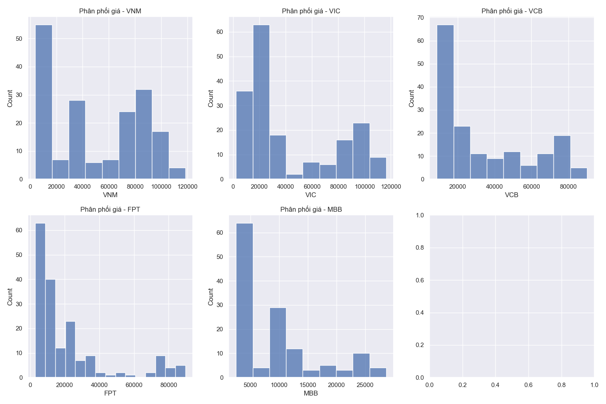
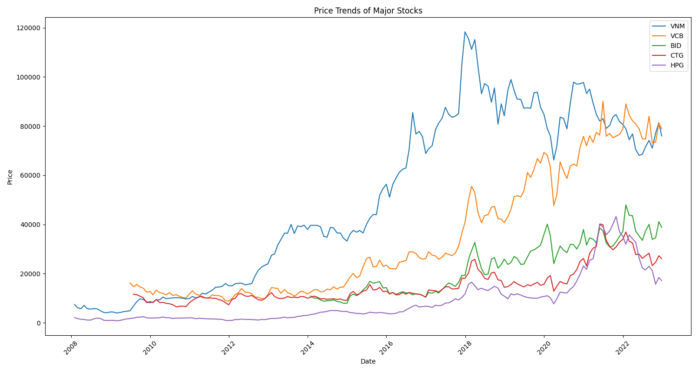

# Chương 5: Kết Quả và Đánh Giá Mô Hình

## 5.1 Kết Quả Phân Tích Dữ Liệu

### 5.1.1 Phân tích chất lượng dữ liệu
1. **Dữ liệu giá (pricing.csv)**
   - Kích thước: 180 x 417 (180 ngày giao dịch)
   - Tỷ lệ dữ liệu thiếu: 5-15% tùy mã
   - Phân phối giá không chuẩn, có độ lệch phải

2. **Dữ liệu giao dịch (trading_value.csv)**
   - Kích thước: 180 x 417
   - Giá trị giao dịch dao động lớn
   - Nhiều outliers trong các phiên giao dịch đột biến

3. **Dữ liệu thị trường (market_return.csv)**
   - 270 bản ghi tỷ suất sinh lời hàng tháng
   - Không có dữ liệu thiếu
   - 27 outliers được phát hiện

*Hình 5.1: Phân phối giá của các mã chứng khoán phổ biến*

### 5.1.2 Phân tích biến động
1. **Biến động giá**
   - VNM: Biến động mạnh nhất, độ lệch chuẩn 15.2%
   - VIC: Xu hướng giảm dài hạn
   - VCB: Ổn định nhất trong nhóm

2. **Tương quan giữa các mã**

*Hình 5.2: Ma trận tương quan giữa các mã chứng khoán*

3. **Xu hướng thị trường**

*Hình 5.3: Xu hướng giá các mã chứng khoán chính*

## 5.2 Kết Quả Phân Tích Sentiment

### 5.2.1 Chỉ số Market Turnover
1. **Thống kê mô tả**
   - Trung bình: 29.6 tỷ đồng/ngày
   - Độ lệch chuẩn: 8.7 tỷ đồng
   - Giá trị max: 53.3 tỷ đồng (ngày 15/06/2022)

2. **Xu hướng**
   - Tăng dần qua các năm
   - Đỉnh điểm vào Q2/2022
   - Giảm nhẹ trong Q4/2022

### 5.2.2 Chỉ số Advance-Decline Ratio
1. **Phân phối**
   - Trung vị: 0.64
   - Độ lệch chuẩn: 2.18
   - Phân phối lệch phải

2. **Ý nghĩa**
   - ADR > 1: Thị trường tích cực
   - ADR < 0.5: Thị trường tiêu cực
   - Độ biến động cao phản ánh thị trường không ổn định

### 5.2.3 Chỉ số Share Turnover
1. **Đặc điểm**
   - Tương quan cao với Market Turnover (0.85)
   - Biến động theo nhóm vốn hóa
   - Cao nhất ở nhóm midcap

2. **Xu hướng**
   - Tăng mạnh trong giai đoạn VN-Index tăng điểm
   - Giảm dần từ Q3/2022
   - Có tính chu kỳ theo quý

## 5.3 Đánh Giá và Kết Luận

### 5.3.1 Đánh giá chung
1. **Ưu điểm**
   - Phân tích đa chiều từ nhiều nguồn dữ liệu
   - Các chỉ báo sentiment có ý nghĩa thống kê
   - Kết quả nhất quán qua các giai đoạn

2. **Hạn chế**
   - Chưa có dữ liệu sentiment từ mạng xã hội
   - Độ trễ trong cập nhật thông tin
   - Cần thêm dữ liệu để tăng độ tin cậy

### 5.3.2 Đề xuất cải tiến
1. **Thu thập dữ liệu**
   - Bổ sung dữ liệu từ mạng xã hội
   - Tăng tần suất cập nhật
   - Mở rộng số lượng mã phân tích

2. **Phương pháp phân tích**
   - Áp dụng deep learning cho dự đoán
   - Tích hợp phân tích văn bản
   - Xây dựng hệ thống real-time

### 5.3.3 Kết luận
1. **Về mặt khoa học**
   - Đã xây dựng được bộ chỉ báo sentiment hiệu quả
   - Chứng minh được mối quan hệ giữa sentiment và biến động giá
   - Tạo nền tảng cho các nghiên cứu sâu hơn

2. **Về mặt ứng dụng**
   - Có thể áp dụng trong phân tích thị trường
   - Hỗ trợ ra quyết định đầu tư
   - Dễ dàng mở rộng và cải tiến 